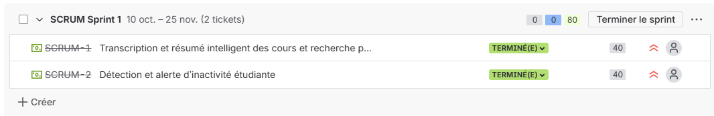
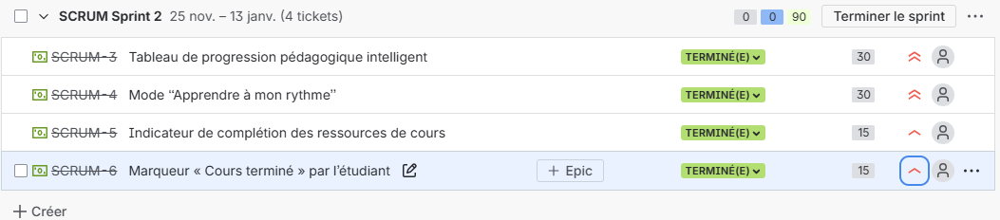
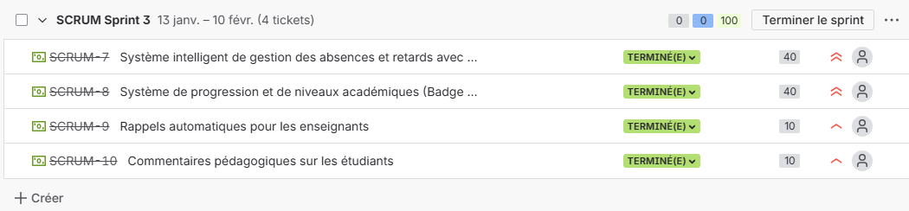
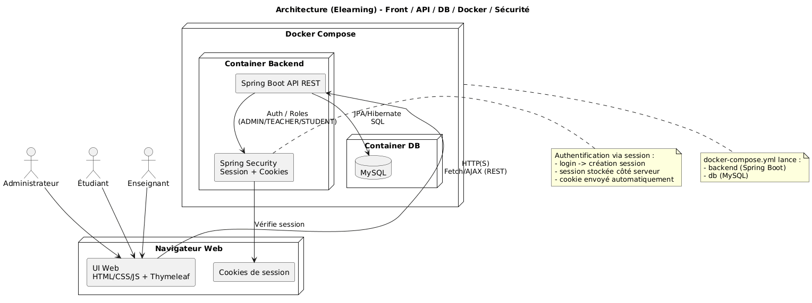
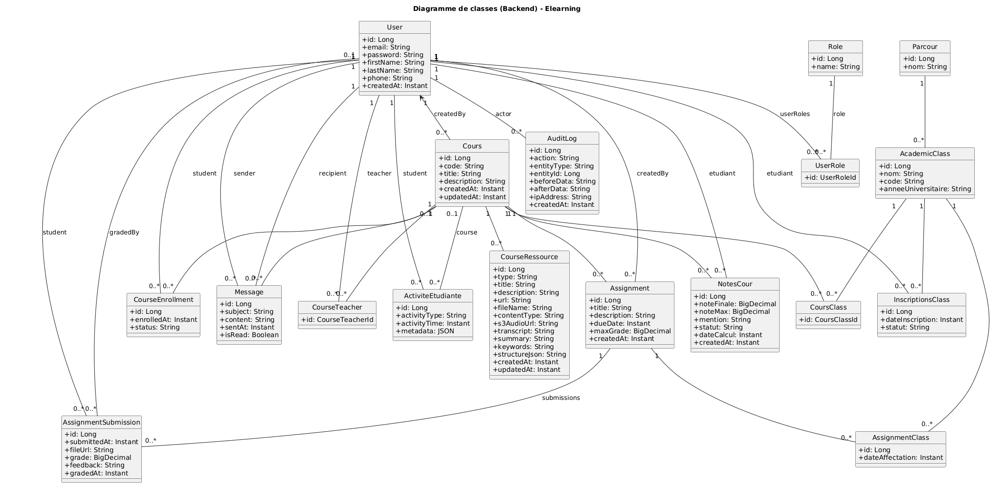

# Elearning

## Couverture

- **Nom du projet :** Elearning
- **Auteurs :** GOUASMI Yassine, SAKHO Moussa , MEKKIOU Adam   
- **Formation :** Master 1 MIAGE
- **Date :** 27/02/2026
- **Encadrant :** Poizat Pascal

---


## 1. Contexte

### 1.1 Qui ?

La plateforme e-learning est destinée à trois types d’utilisateurs principaux :

- **Les étudiants**, qui accèdent aux cours, ressources pédagogiques, devoirs, et peuvent suivre leur progression.
- **Les enseignants**, qui créent et gèrent les contenus pédagogiques (cours, notes, devoirs), suivent les performances des étudiants et communiquent avec eux.
- **Les administrateurs**, qui supervisent la plateforme, gèrent les utilisateurs, les rôles et assurent la sécurité et la bonne gestion du système.

### 1.2 Quoi ?

Le projet consiste à développer une plateforme web d’e-learning modulaire, sécurisée et scalable, permettant la gestion complète d’un environnement d’apprentissage en ligne.  
Elle offre aux enseignants la possibilité de créer et organiser des cours, quiz et devoirs, tout en permettant aux étudiants d’accéder aux contenus pédagogiques et de suivre leur progression.
La plateforme repose sur une architecture moderne basée sur Spring Boot, une API REST sécurisée, une base de données MySQL et une conteneurisation avec Docker.  
Le frontend est développé en HTML, CSS et JavaScript avec l’intégration de Thymeleaf pour le rendu dynamique côté serveur.
  
### 1.3 Pourquoi ?

Ce projet s’inscrit dans un objectif pédagogique visant à mettre en pratique les méthodes agiles de gestion de projet, notamment à travers un développement itératif et incrémental.  
L’objectif principal est d’apprendre à structurer un projet logiciel autour des concepts clés de l’agilité, tels que les **user stories**, la priorisation par la **valeur métier**, ainsi que la planification par itérations.

La plateforme e-learning constitue un cas d’étude pertinent, car elle permet de définir des fonctionnalités claires, d’identifier les besoins des utilisateurs et d’évaluer leur impact métier.  
Elle offre également un cadre concret pour expérimenter la collaboration en équipe, la gestion des versions, la validation continue et l’amélioration progressive du produit.


---

## 2. Analyse de la concurrence

Dans le domaine des plateformes d’apprentissage en ligne, plusieurs solutions existent déjà. Nous avons étudié notamment Moodle et Google Classroom, qui sont largement utilisées dans les établissements d’enseignement.

### Moodle

Moodle est une plateforme open source très complète, permettant la gestion de cours, de ressources pédagogiques, de quiz, d’évaluations et de suivi des étudiants.  
Elle offre un haut niveau de personnalisation et est souvent utilisée dans les universités et les écoles.

Cependant, Moodle présente certaines limites :
- Une interface parfois complexe et peu intuitive pour les nouveaux utilisateurs.
- Une architecture monolithique qui peut être difficile à maintenir ou à faire évoluer.
- Une mise en place technique parfois lourde pour les petites structures.

### Google Classroom

Google Classroom est une solution simple et intuitive, intégrée à l’écosystème Google. Elle permet de gérer les cours, les devoirs et la communication entre enseignants et étudiants de manière efficace.

Ses principales forces sont :
- Une grande simplicité d’utilisation.
- Une intégration fluide avec les outils Google (Drive, Docs, Meet).
- Une accessibilité rapide via le cloud.

Cependant, cette solution présente également des limites :
- Peu de personnalisation et de modularité.
- Une dépendance forte à l’écosystème Google.
- Des fonctionnalités avancées limitées pour certaines institutions.

### Positionnement du projet

Notre plateforme e-learning vise à proposer une solution intermédiaire :  
un système modulaire, moderne et sécurisé, inspiré des fonctionnalités essentielles de ces plateformes, tout en mettant l’accent sur une architecture évolutive, basée sur des technologies récentes (Spring Boot, API REST, Docker).

L’objectif n’est pas de concurrencer directement ces solutions à grande échelle, mais de concevoir une plateforme pédagogique permettant d’expérimenter les bonnes pratiques d’architecture logicielle, de sécurité et de gestion de projet agile.

---

## 3. Architecture & Technologies

Le projet repose sur une architecture moderne en trois couches (3-tiers), permettant de séparer clairement les responsabilités entre la présentation, la logique métier et la persistance des données. Cette organisation favorise la maintenabilité, la scalabilité et la sécurité du système.

### 3.1 Frontend

Le frontend est développé en **HTML, CSS et JavaScript**, avec l’utilisation de **Thymeleaf** pour le rendu dynamique côté serveur.  
Cette approche permet d’intégrer directement les données provenant du backend dans les vues, tout en conservant une architecture compatible avec une API REST.

Des appels asynchrones (AJAX / Fetch) sont utilisés pour communiquer avec le backend et récupérer les données de manière dynamique, améliorant ainsi l’expérience utilisateur.

### 3.2 Backend

Le backend est développé avec **Spring Boot**, en adoptant une architecture modulaire et basée sur les bonnes pratiques de développement logiciel.  
Il expose une **API REST** permettant de gérer les différentes fonctionnalités de la plateforme, telles que :

- Gestion des utilisateurs (étudiants, enseignants, administrateurs)
- Gestion des cours et ressources pédagogiques
- Gestion des notes et devoirs
- Sécurisation des accès

L’architecture backend suit une organisation en couches :
- **Controller** : gestion des requêtes HTTP
- **Service** : logique métier
- **Repository** : accès aux données

### 3.3 Sécurité

La sécurité est assurée grâce à **Spring Security**, avec un système d’authentification .  
Ce mécanisme permet :

- Une authentification stateless
- Une sécurisation des endpoints REST
- Une gestion des rôles (ADMIN, TEACHER, STUDENT)
- Une protection contre les accès non autorisés

### 3.4 Base de données

Le système utilise **MySQL** pour le stockage des données.  
Cette base permet de gérer :

- Les comptes utilisateurs
- Les cours et modules
- Les ressources pédagogiques
- Les résultats et évaluations

L’accès à la base est réalisé via l’ORM de Spring Boot.

### 3.5 Conteneurisation et déploiement

Le projet est conteneurisé avec **Docker**, afin de faciliter le déploiement et la reproductibilité de l’environnement.  
Un fichier `docker-compose.yml` permet de lancer rapidement les services nécessaires :

- Backend Spring Boot
- Base de données MySQL

Cette approche garantit une meilleure portabilité et simplifie la mise en production.

---

## 4. Gestion de projet

Le projet a été réalisé en suivant une approche agile, avec un développement itératif et incrémental.  
L’objectif principal était de structurer le travail autour de la valeur métier et de livrer progressivement des fonctionnalités fonctionnelles.

### 4.1 Organisation du travail

Le projet a été découpé en plusieurs itérations (sprints), chacune ayant pour objectif de livrer un ensemble cohérent de fonctionnalités.  
Chaque sprint a permis de :

- Définir les besoins sous forme de **user stories**
- Prioriser les fonctionnalités en fonction de leur valeur métier
- Développer et tester les fonctionnalités


### 4.2 Gestion des fonctionnalités

Les fonctionnalités ont été définies sous forme de user stories afin de se concentrer sur les besoins des utilisateurs (étudiants, enseignants, administrateurs).  
Chaque fonctionnalité a été développée de manière incrémentale, en commençant par les cas d’usage essentiels.


### 4.3 Réunions et validation

Des réunions de type **Sprint Review** ont été organisées afin de présenter les fonctionnalités développées et de valider les choix réalisés.  
Ces échanges ont permis d’identifier les axes d’amélioration et d’adapter le projet au fil des itérations.

### 4.4 Gestion de versions

Le code source a été géré avec Git et hébergé sur GitHub. 
### 4.5 Outils de gestion de projet

Afin d’organiser le travail et de suivre l’avancement du projet, l’équipe a utilisé plusieurs outils collaboratifs.

#### Jira

L’outil **Jira** a été utilisé pour la gestion des tâches et des user stories.  
Il a permis de structurer le projet de manière agile en facilitant la planification, le suivi et la priorisation des fonctionnalités.

Les principales utilisations de Jira ont été :
- Création des **user stories** à partir des besoins des utilisateurs.
- Organisation du travail en **sprints**.
- Suivi de l’avancement avec un **tableau Scrum**.
- Priorisation des fonctionnalités en fonction de leur **valeur métier**.
- Répartition des tâches entre les membres de l’équipe.
- Suivi des bugs et des améliorations.

Chaque itération du projet correspondait à un sprint Jira, avec des réunions de type **Sprint Review** afin de valider les fonctionnalités développées.
### 4.6 Suivi Agile avec Jira

Le projet a été organisé en sprints à l’aide de l’outil Jira.  
Chaque fonctionnalité a été modélisée sous forme de user stories et intégrée dans un sprint.  
Le tableau Jira a permis de suivre l’avancement, la répartition des tâches et la progression du projet.





---

## 5. Diagrammes UML

### 5.1 Diagramme d’architecture

Le diagramme suivant décrit l’architecture 3-tiers : un frontend web (HTML/CSS/JS + Thymeleaf) communiquant avec un backend Spring Boot via une API REST sécurisée , et une base MySQL. L’ensemble est conteneurisé via Docker Compose.



### 5.2 Diagramme de classes (backend)

Le diagramme de classes ci-dessous représente les principales entités métier du backend (utilisateurs, cours, inscriptions, devoirs, soumissions, messages, logs…) ainsi que leurs relations (OneToMany, ManyToOne).


---

## 6. Fonctionnalités

### Feature 1 — Transcription et résumé intelligent des cours

**But :**  
Permettre aux étudiants d’accéder à des contenus pédagogiques enrichis grâce à la transcription automatique, au résumé intelligent et à l’extraction de mots-clés. Cela facilite la recherche, la révision et l’accessibilité des cours.

**Persona :**  
Un étudiant souhaitant retrouver rapidement une notion importante dans un cours audio ou vidéo.

**Scénario :**  
L’étudiant consulte une ressource de cours. Le système génère automatiquement une transcription et un résumé. Les mots-clés sont extraits et indexés afin de permettre une recherche rapide.

---

### Feature 2 — Détection et alerte d’inactivité étudiante

**But :**  
Identifier les étudiants inactifs afin d’améliorer l’engagement et prévenir le décrochage.

**Persona :**  
Un enseignant souhaitant suivre l’implication des étudiants.

**Scénario :**  
Le système analyse l’activité des étudiants (connexion, progression, interactions). En cas d’inactivité prolongée, une alerte est générée pour l’enseignant ou l’administration.

---

### Feature 3 — Tableau de progression pédagogique intelligent

**But :**  
Offrir une visualisation claire et synthétique de la progression académique des étudiants.

**Persona :**  
Un enseignant ou étudiant souhaitant suivre les performances et les progrès.

**Scénario :**  
L’utilisateur accède à un tableau de bord présentant les statistiques de progression, les résultats et les recommandations pédagogiques.

---

### Feature 4 — Apprendre à son rythme (parcours personnalisé)

**But :**  
Adapter les contenus pédagogiques en fonction du niveau et du rythme de l’étudiant.

**Persona :**  
Un étudiant ayant besoin d’un apprentissage flexible et personnalisé.

**Scénario :**  
Le système propose un parcours adapté en fonction des performances, des préférences et de la progression de l’étudiant.

---

### Feature 5 — Gestion intelligente des absences et retards

**But :**  
Automatiser le suivi des absences et améliorer la communication avec l’administration.

**Persona :**  
Un enseignant souhaitant gérer efficacement la présence.

**Scénario :**  
Les absences et retards sont enregistrés automatiquement et remontés aux services administratifs pour un suivi global.

---

### Feature 6 — Système de badges et niveaux académiques

**But :**  
Motiver les étudiants grâce à un système de gamification.

**Persona :**  
Un étudiant souhaitant suivre sa progression et être récompensé.

**Scénario :**  
Le système attribue des badges et des niveaux en fonction des activités et des performances.

---

### Feature 7 — Indicateur de complétion des ressources (petite feature)

**But :**  
Permettre aux étudiants et aux enseignants de visualiser rapidement le niveau d’avancement dans un cours.

**Persona :**  
Un étudiant souhaitant savoir quelles ressources ont déjà été consultées.

**Scénario :**  
Lorsqu’un étudiant consulte une ressource, celle-ci est marquée comme complétée. Un indicateur visuel (pourcentage ou barre de progression) est mis à jour automatiquement.

---

### Feature 8 — Marqueur “Cours terminé” avec feedback (petite feature)

**But :**  
Encourager les étudiants à finaliser les cours et améliorer l’engagement grâce à un retour pédagogique.

**Persona :**  
Un étudiant souhaitant valider l’achèvement d’un cours.

**Scénario :**  
À la fin d’un cours, l’étudiant peut marquer le cours comme terminé. Le système affiche un message de félicitations et peut proposer des recommandations pour la suite.

---

### Feature 9 — Rappels automatiques simples pour les enseignants (petite feature)

**But :**  
Aider les enseignants à ne pas oublier certaines tâches importantes.

**Persona :**  
Un enseignant souhaitant être alerté des échéances.

**Scénario :**  
Le système envoie des notifications concernant les devoirs à corriger, les absences à valider ou certaines actions pédagogiques.

---

### Feature 10 — Commentaires pédagogiques rapides (petite feature)

**But :**  
Faciliter la communication pédagogique et le suivi des étudiants.

**Persona :**  
Un enseignant souhaitant donner un retour rapide.

**Scénario :**  
L’enseignant peut ajouter rapidement des commentaires courts sur un étudiant, visibles ensuite dans le tableau de suivi.

---

## 7. Synthèse fonctionnelle

| Feature | Valeur métier | Priorité | Complexité |
|--------|---------------|----------|------------|
| Transcription et résumé intelligent | Accessibilité, compréhension | Haute | Élevée |
| Détection d’inactivité | Engagement, prévention décrochage | Haute | Moyenne |
| Tableau de progression | Suivi pédagogique | Haute | Moyenne |
| Parcours personnalisé | Apprentissage individualisé | Haute | Élevée |
| Gestion absences/retards | Suivi académique | Moyenne | Moyenne |
| Badges et niveaux | Motivation | Moyenne | Faible |
| Indicateur complétion | Engagement UX | Moyenne | Faible |
| Marqueur cours terminé | Engagement | Moyenne | Faible |
| Rappels enseignants | Organisation | Moyenne | Faible |
| Commentaires rapides | Suivi, communication | Moyenne | Faible |

---

### Répartition des contributions

| Feature | Adam | Yassine | Moussa |
|--------|------|---------|--------|
| Transcription et résumé intelligent | 33% | 33% | 33% |
| Détection d’inactivité | 33% | 33% | 33% |
| Tableau de progression | 33% | 33% | 33% |
| Parcours personnalisé | 33% | 33% | 33% |
| Gestion absences/retards | 33% | 33% | 33% |
| Badges et niveaux | 33% | 33% | 33% |
| Indicateur complétion | 33% | 33% | 33% |
| Marqueur cours terminé | 33% | 33% | 33% |
| Rappels enseignants | 33% | 33% | 33% |
| Commentaires rapides | 33% | 33% | 33% |

---

## 8. Synthèse technique

| Composant | Technologie | Rôle |
|------|------|------|
| Backend | Spring Boot | Développement de l’API REST et de la logique métier |
| Sécurité | Spring Security  | Authentification et gestion des rôles |
| Frontend | HTML, CSS, JavaScript, Thymeleaf | Interface utilisateur et rendu dynamique |
| Communication | API REST | Interaction entre frontend et backend |
| Base de données | MySQL | Stockage des données |
| ORM | JPA / Hibernate | Persistance et gestion des entités |
| DevOps | Docker, Docker Compose | Conteneurisation et reproductibilité |
| Versioning | Git, GitHub | Gestion collaborative du code |

---

## 9. Éléments techniques

### 9.1 Environnement d’exécution

Le projet a été conçu afin d’être exécuté dans un environnement reproductible et proche des conditions de production.  
Pour cela, une approche hybride a été adoptée : les services d’infrastructure sont conteneurisés avec Docker, tandis que le backend Spring Boot est exécuté localement pour faciliter le développement.


---

### 9.2 Lancement de l’application

Le lancement de l’application se fait en deux étapes.

#### Étape 1 : démarrage des conteneurs

```bash
docker compose up --build
```
#### Étape 2 : démarrage du backend
```bash
./gradlew bootRun
```

---


#### 9.3 Structure du projet

Le projet suit une architecture en couches, conforme aux bonnes pratiques du framework Spring Boot :

- **controller/** : exposition des endpoints REST (réception des requêtes HTTP, validation des entrées, réponses JSON).
- **service/** : implémentation de la logique métier (règles, orchestrations, traitements).
- **repository/** : accès aux données via Spring Data JPA (CRUD, requêtes, persistance).
- **entities/** : entités JPA représentant le modèle de données (relations `@OneToMany`, `@ManyToOne`, etc.).
- **security/** : configuration de Spring Security, gestion des rôles et des autorisations.
- **config/** *(si présent)* : configuration applicative (CORS, beans, mapping, etc.).
- **resources/** : fichiers de configuration (ex : `application.yml/properties`), templates Thymeleaf, fichiers statiques.

Cette organisation permet une séparation claire des responsabilités et facilite la maintenance, l’évolution et les tests.

---

### 9.4 Choix techniques et justifications

Les technologies utilisées ont été sélectionnées afin de répondre aux exigences de sécurité, de maintenabilité et d’évolutivité :

- **Spring Boot** : framework robuste permettant de développer rapidement une application structurée (injection de dépendances, configuration, écosystème mature).
- **API REST** : séparation claire frontend/backend, facilite l’évolution (possibilité d’ajouter un autre client : mobile, SPA, etc.).
- **Spring Security ** : authentification sécurisée et *stateless*, adaptée aux API REST, avec contrôle d’accès par rôles (**ADMIN**, **TEACHER**, **STUDENT**).
- **MySQL** : base relationnelle fiable, adaptée aux relations entre entités (cours, utilisateurs, inscriptions, devoirs, messages…).
- **JPA/Hibernate** : simplifie la persistance, réduit le code SQL, et permet de travailler directement avec le modèle objet.
- **Docker + Docker Compose** : reproductibilité de l’environnement (DB + outils), simplifie l’installation et la démonstration du projet.
- **Thymeleaf + JavaScript** : rendu dynamique côté serveur et interactions asynchrones (Fetch/AJAX) pour une interface web simple et légère.


## 10. Perspectives


### 10.1 Évolutions à moyen et long terme

À plus long terme, plusieurs évolutions techniques pourraient être mises en œuvre afin d’améliorer la scalabilité et la flexibilité de la plateforme.

Une première évolution consisterait à migrer vers une **architecture microservices**, permettant de découpler les différents modules (authentification, gestion des cours, analytics, etc.). Cette approche améliorerait la maintenabilité et la montée en charge.

Le déploiement sur une infrastructure cloud (par exemple AWS ou Azure) permettrait également :
- une meilleure disponibilité,
- une élasticité des ressources,
- une gestion facilitée de l’infrastructure.

La mise en place d’un pipeline DevOps complet représenterait un objectif stratégique :
- automatisation des tests,
- intégration et déploiement continus,
- monitoring et observabilité.

Enfin, un renforcement de la sécurité pourrait être envisagé, notamment avec l’intégration de standards comme OAuth2, OpenID Connect et une gestion avancée des identités.

---

### 10.2 Intelligence artificielle et analyse de données

Le projet offre également de nombreuses perspectives dans le domaine de l’intelligence artificielle et de l’analyse des données pédagogiques.

Parmi les évolutions possibles :
- recommandation automatique de contenus pédagogiques adaptés aux étudiants,
- analyse prédictive du risque de décrochage,
- personnalisation avancée des parcours d’apprentissage,
- assistance pédagogique intelligente,
- analyse des comportements d’apprentissage et génération de rapports.

Ces améliorations permettraient de transformer la plateforme en un système intelligent, adaptatif et orienté vers la réussite des étudiants.
## 11. Annexe – API REST

Cette section présente les principaux endpoints de l’API REST développée avec Spring Boot.  
L’API permet la gestion des utilisateurs, des cours, des ressources pédagogiques, des devoirs et de la progression des étudiants.

L’architecture repose sur une communication REST sécurisée via Spring Security .  
Les requêtes nécessitent un token d’authentification envoyé dans le header :

Authorization: Bearer <token>

---

### 11.1 Authentification et sécurité

Les endpoints suivants permettent la gestion de l’authentification :

| Méthode | Endpoint | Description |
|------|------|------|
| POST | /api/auth/login | Authentification   |
| POST | /api/auth/register | Création d’un compte utilisateur |

Les rôles gérés sont :
- ADMIN
- TEACHER
- STUDENT

---

### 11.2 Gestion des utilisateurs

| Méthode | Endpoint | Description |
|------|------|------|
| GET | /api/users | Liste des utilisateurs |
| GET | /api/users/{id} | Détails d’un utilisateur |
| PUT | /api/users/{id} | Mise à jour d’un utilisateur |
| DELETE | /api/users/{id} | Suppression d’un utilisateur |

---

### 11.3 Gestion des cours

| Méthode | Endpoint | Description |
|------|------|------|
| GET | /api/courses | Liste des cours |
| POST | /api/courses | Création d’un cours |
| GET | /api/courses/{id} | Détails d’un cours |
| PUT | /api/courses/{id} | Mise à jour d’un cours |
| DELETE | /api/courses/{id} | Suppression d’un cours |

---

### 11.4 Ressources pédagogiques

| Méthode | Endpoint | Description |
|------|------|------|
| GET | /api/resources | Liste des ressources |
| POST | /api/resources | Ajout d’une ressource |
| GET | /api/resources/{id} | Détails d’une ressource |
| DELETE | /api/resources/{id} | Suppression d’une ressource |

---

### 11.5 Devoirs et soumissions

| Méthode | Endpoint | Description |
|------|------|------|
| GET | /api/assignments | Liste des devoirs |
| POST | /api/assignments | Création d’un devoir |
| GET | /api/assignments/{id} | Détails d’un devoir |
| POST | /api/submissions | Soumission d’un devoir |
| GET | /api/submissions/{id} | Détails d’une soumission |

---

### 11.6 Progression et suivi

| Méthode | Endpoint | Description |
|------|------|------|
| GET | /api/progress | Progression globale |
| GET | /api/activities | Activités des étudiants |
| GET | /api/analytics | Indicateurs pédagogiques |

---

